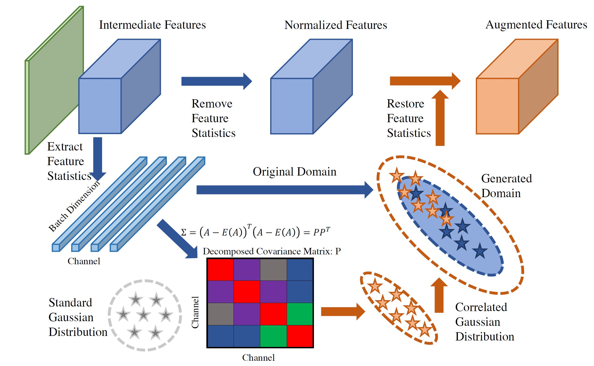

# CSU
["Domain Generalization with Correlated Style Uncertainty"](https://arxiv.org/abs/2212.09950), WACV2024

Domain generalization (DG) approaches intend to extract domain invariant features that can lead to a more robust deep learning model. In this regard, style augmentation is a strong DG method taking advantage of instance-specific feature statistics containing informative style characteristics to synthetic novel domains. While it is one of the state-of-the-art methods, prior works on style augmentation have either disregarded the interdependence amongst distinct feature channels or have solely constrained style augmentation to linear interpolation. To address these research gaps, in this work, we introduce a novel augmentation approach, named \textit{Correlated Style Uncertainty (CSU)}, surpassing the limitations of linear interpolation in style statistic space and simultaneously preserving vital correlation information. Our method's efficacy is established through extensive experimentation on diverse cross-domain computer vision and medical imaging classification tasks: PACS, Office-Home, and Camelyon17 datasets, and Duke-Market1501 instance retrieval task.

